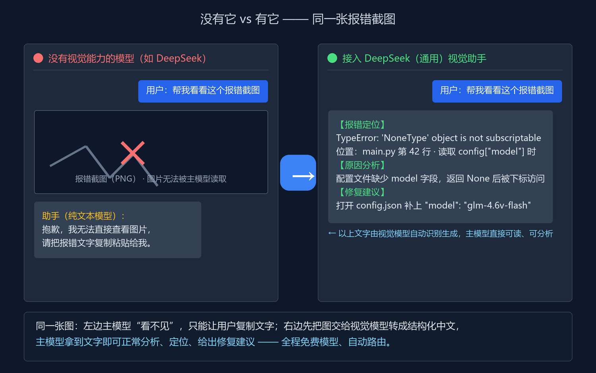

<div align="center">

# DeepSeek（通用）视觉助手

**为 DeepSeek 等纯文本模型装上"眼睛"：图片 → 结构化中文文字，免费视觉模型自动路由、自动降级、额度熔断。**

[](https://github.com/hnweiyi/deepseek-vision-helper/stargazers)
[](LICENSE)
[](https://www.python.org/downloads/)
[]()

> **⚠️ 非官方社区项目**：本工具与 DeepSeek 官方无任何关联，仅为 DeepSeek 等纯文本模型提供视觉能力补充（Unofficial community tool）。

[为什么用它](#-为什么用它) ｜ [效果演示](#-效果演示) ｜ [什么场景用 + 提示词示例](#-什么场景用--提示词示例) ｜ [和别的方案有什么不同](#-和别的方案有什么不同) ｜ [快速开始](#-快速开始) ｜ [使用](#-使用) ｜ [赞助与支持](#-赞助与支持)

</div>

---

## 💡 为什么用它

**并不是所有 AI 主模型都能"看见"图片。** DeepSeek 等纯文本模型收到截图、报错图、文档照片时，只能"靠猜"，或让用户把文字手动复制一遍——体验割裂、效率低。

本工具给这类模型**补上一双眼睛**：

1. 主模型把图片路径/URL 交给本工具；
2. 脚本自动调用**多个免费视觉大模型**，把图片转成**结构化中文文字**（画面描述 + 图中文字 OCR + 针对性分析）；
3. 主模型拿到文字，就能正常分析报错、读表格、看草图、给建议——**像真的看见了图一样**。

三个关键点：

- **补视觉**：让无视觉模型真正"看懂"图，不靠猜；
- **通用**：核心是零依赖 Python 脚本，**任何能执行命令的 AI agent 都能装**（Codex、Claude Code、自建 agent……），不绑定某一家；
- **全自动**：选模型、失败降级、额度熔断、多模型验证全部自动，你只需说"看这张图"。

---

## 🖼️ 效果演示

同一张报错截图：左边没有它，纯文本模型"看不见"；右边接入本工具，图片自动变成可读的中文分析：



> 演示为示意。实际输出由视觉模型生成，重要报错码/数字建议与原图核对。

---

## 🎯 什么场景用 + 提示词示例

适用于：**程序报错截图、手绘草稿、文档/表格拍照、图表、UI 界面、前后对比、网页配图**……一句话：凡是"需要从图像里获取信息"的场景都能用。

**核心技巧：说得越具体，结果越准。** 明确告诉它"你要什么"，而不是只说"看看这张图"。

| 场景 | 推荐提示词（对 agent 说） | 技能做什么 |
|---|---|---|
| 报错截图 | "帮我看下这个报错，**提取报错码、堆栈关键行，并给出修复建议**" | 自动定位报错码 + 原因 + 修复建议 |
| 网页链接 | "读一下这个网页 `https://...`，**总结要点，并说明页面里的配图分别是什么**" | 抓取网页文字 + 识别配图，综合反馈 |
| 文档/表格照片 | "**逐字提取**这张表的所有文字，**保留行列结构**" | 结构化 OCR（标题/段落/表格） |
| 手绘草稿 | "理解这张草图的**意图**，描述画了什么，并推测我想表达的设计" | 描述画面 + 意图 |
| 前后对比 | "**对比**这两张截图，**列出相同点和不同点**" | 输出差异清单 |
| 图表截图 | "解读这个图表：**类型、坐标轴单位、关键数值、趋势结论**" | 数值 + 趋势 + 结论 |
| 数学题 | "解这道题，**给出详细步骤和最终答案**" | 解题步骤 + 答案 |
| UI 截图 | "分析这个界面的**布局和元素**，指出可能的 UI 问题" | 布局 + UI 问题 |

> 图片越清晰、文字越完整，结果越准；OCR 场景可加 `--max-size 2048` 或 `--no-downscale` 重试。

---

## 🔀 和别的方案有什么不同

市面上给 DeepSeek 补视觉的方案很多（MCP 桥、单模型桥、某某客户端插件），本工具的核心差异是**把它做成了一个带"路由引擎"的通用视觉技能**：

| 对比项 | 常见同类方案 | 本工具 |
|---|---|---|
| 定位 | 单点桥接/单客户端插件 | 通用视觉技能 + 半自动路由引擎，agent 通用 |
| 模型 | 通常 1 个模型写死 | **7 个免费模型 / 3 家厂商**，质量优先自动路由 |
| 失败处理 | 报错就失败 | 按原因分类降级（404→同组换模型；额度尽→换厂商；429→退避重试） |
| 额度管理 | 无（撞上限才发现） | 本地按日计数**熔断**，超限自动切其它免费模型 |
| 结果可信度 | 单模型单次回答 | 关键任务**三厂商并发 + Agnes 汇总** + 任务类型自动校验重跑 |
| 改模型 | 改代码 / 改环境变量 | **图形化界面**增删改测，零代码 |
| 网页+图片 | 只识图 | 既能识图，也能**读网页正文 + 识别网页配图**综合反馈 |
| 适配平台 | 绑定某家 agent/客户端 | Codex / Claude Code / 任意能跑命令的 agent |

**默认全部用免费模型**（智谱 GLM、魔搭 Qwen3-VL、Agnes 的免费档），个人作为主模型的专用视觉辅助，完全够用；想换付费更强的模型也随时可加。

---

## 🚀 快速开始

### 环境要求

| 项 | 要求 |
|---|---|
| Python | **3.8 或更高**（零第三方依赖，PIL 可选） |
| 操作系统 | Windows（key 加密用 DPAPI） |

### 安装（GitHub 下载后 3 步）

1. **下载并解压**本仓库，得到文件夹（默认叫 `deepseek-vision-helper/`）；
2. **放进技能目录**：Codex 用户放到 `C:\Users\<你的用户名>\.codex\skills\<文件夹名>\`；Claude Code、自建 agent 放到它自己的 skills 目录即可——**不依赖 Codex**；
   - 更省事：直接把本仓库链接发给你的 agent，说"**下载并安装这个 skill**"，支持技能安装的 agent（Codex / Claude Code）会自动完成；
3. **装 Python 3.8+**：`py -3.8 --version` 能输出版本号即可。

> 不想放 skills 目录也行：直接以完整路径调用 `<技能目录>\scripts\` 下的脚本即可。

### 目录结构

```
<技能目录>
├── SKILL.md                # 给 agent 看的技能说明
├── README.md               # 本文档
├── config.json             # 实际配置（含加密 key，不入 git；缺失时自动生成）
├── config.example.json     # 配置模板
├── 配置工具.bat             # 图形化配置双击启动器
├── assets/                 # 演示图与社交预览图
└── scripts/
    ├── analyze.py          # 主脚本：图片 → 视觉模型 → 文字（半自动路由）
    ├── read_web.py         # 网页文字 + 图片综合读取
    ├── config_server.py    # 图形化配置本地服务器
    ├── set_key.py          # 命令行改 key/地址/模型
    ├── encrypt_key.py      # key 批量加密
    ├── find_image.py       # 查找最近图片
    ├── safe_net.py         # 网络/图片安全校验（SSRF、格式、解压炸弹）
    ├── quota.py            # 额度计数与限速
    └── dpapi.py            # Windows DPAPI 加解密
```

### 首次配置（填 key，约 1 分钟）

**不用手动复制任何文件**：第一次启动配置工具或运行脚本时，程序会自动按 `config.example.json` 生成一份空白 `config.json`（只差 key，未配置的模型会自动跳过）。

1. **双击 `配置工具.bat`**（或对 agent 说"打开配置 / 改 key / 改模型"）→ 浏览器自动打开图形化界面；
2. 点选左侧某个模型 → 右侧把 `api_key` 填成你的 key（明文输入，保存时自动 DPAPI 加密）→ 点「保存」；同一平台多个模型**共用一把 key**，共需填 3 把：
   - 智谱 GLM 系列 → 填智谱 API Key（[open.bigmodel.cn](https://open.bigmodel.cn)）；
   - 魔搭 Qwen3-VL 系列 → 填 ModelScope Token（[modelscope.cn](https://modelscope.cn)）；
   - Agnes → 填 Agnes API Key（[agnes-ai.cn](https://agnes-ai.cn)）；
3. 每行「测试」可即时验证 key 是否有效；全部保存后即可使用。

没有图形界面时用命令行填写：`py -3.8 "<技能目录>\scripts\set_key.py"`，按提示选择供应商并输入明文 key（保存时自动加密）。

### 最简用法（对 agent 说一句话）

> "看看这张图：`C:\xxx\报错.png`"

> "读一下这个网页 `https://xxx`，总结要点并说明配图是什么"

> "对比这两张截图，列出差异：`a.png` `b.png`"

也可以直接命令行调用：

```bat
py -3.8 "<技能目录>\scripts\analyze.py" "<图片路径或URL>" --task general -f "重点描述画面内容"
py -3.8 "<技能目录>\scripts\read_web.py" "https://example.com" -f "总结要点"
```

---

## 📋 使用

### 任务类型（11 类）

`--task` 决定**分析提示词、图片分辨率、路由去向**。主模型先粗判，必要时由 Agnes 校验纠正。

| task | 用途 | 典型触发语 | 分辨率 |
|---|---|---|---|
| `general` | 通用三段式（画面描述 / 文字内容 / 分析） | "看看这张图" | 1568 |
| `ocr` | 逐字提取图中文字 | "提取文字" | 2048 |
| `error` | 报错定位：报错码/堆栈/原因/修复 | "看报错" | 2048 |
| `ui` | 界面布局与 UI 问题 | "分析这个界面" | 1568 |
| `chart` | 图表解读（类型/坐标/数值/趋势） | "解读图表" | 1568 |
| `compare` | 多图对比差异（需 ≥2 张图） | "对比这两张图" | 1568 |
| `document` | 长文档结构化提取（标题/段落/表格） | "提取文档内容" | 2048 |
| `math_stem` | 数学/科学题，给出解题步骤与答案 | "解这道题" | 1568 |
| `detail` | 高精度细节（小字/纹理/细小差异） | "放大看细节" | 2048 |
| `video` | 视频帧/截图内容描述 | "描述这个画面" | 1568 |
| `unknown` | 兜底（等同 general） | — | 1568 |

### analyze.py 参数

```bat
py -3.8 "<技能目录>\scripts\analyze.py" <图片路径或URL...> [选项]
```

| 参数 | 说明 |
|---|---|
| `-f, --focus` | 关注点/问题 |
| `--task` | 11 类任务之一（默认 general） |
| `--provider` | 强制用某个供应商（绕过路由） |
| `--json` | JSON 输出（多模型时含 `results` / `summarizer`） |
| `--max-size N` | 图片长边像素上限 |
| `--auto-trim` | 裁剪纯色/空白边缘 |
| `--brief` | 紧凑证据输出，省 token |
| `--no-downscale` | 不压缩原图 |
| `--multi` | 强制多模型并发 + 汇总 |
| `--serial` | 强制单模型串行降级 |
| `--no-task-check` | 关闭 Agnes 任务校验 |
| `--config` | 指定 config.json 路径 |

### read_web.py（网页综合读取）

```bat
py -3.8 "<技能目录>\scripts\read_web.py" "<网页URL...>" [--max-images N] [--no-images] [--json] ...
```

### key / 配置管理 / 找图

```bat
py -3.8 "<技能目录>\scripts\set_key.py"                      # 命令行交互改 key/地址/模型
py -3.8 "<技能目录>\scripts\encrypt_key.py" --encrypt-config  # 一键加密所有明文 key
py -3.8 "<技能目录>\scripts\find_image.py" --since 15 --count 1   # 找最近新增图片
```

---

## 🧠 模型与路由机制

### 默认模型（7 个，三厂商）

| provider name | 模型 | 厂商 | 定位 |
|---|---|---|---|
| `modelscope-235b` | Qwen3-VL-235B-A22B-Instruct | modelscope | 旗舰，默认最强 |
| `glm` | GLM-4.6V-Flash | glm | 智谱主力 |
| `glm-thinking` | GLM-4.1V-Thinking-Flash | glm | 数学/图表特化 |
| `modelscope-8b-thinking` | Qwen3-VL-8B-Thinking | modelscope | 思考版 8B |
| `modelscope-8b` | Qwen3-VL-8B-Instruct | modelscope | 轻量 8B |
| `glm4v` | GLM-4V-Flash | glm | 轻量兜底 |
| `agnes` | Agnes-2.5-Flash | agnes | 汇总器 + 最后兜底 |

### 质量优先降级链

`default_chain`（通用任务）：**235b → glm → glm-thinking → 8b-thinking → 8b-instruct → glm4v → agnes**

特化覆盖（override）：
- `math_stem`、`chart`：**glm-thinking → glm → 235b → 8b-thinking → 8b-instruct → glm4v → agnes**（数学/图表是 GLM-4.1V-Thinking 的专项强项）

单模型任务：首选失败就沿链降级。

### 失败分类降级

| 失败 | 处理 |
|---|---|
| 404 / 模型不存在 | 同组换模型（如 235b → 8b-thinking） |
| 额度尽 | 跨组换厂商（魔搭 → glm） |
| 429 / 5xx / 网络 | 退避重试，仍失败再降级 |

### 关键任务多模型 + Agnes 汇总

`multi_tasks = error / math_stem / detail / compare`：自动**三厂商并发**（魔搭组、智谱组、Agnes 组各出最强，组内失败自动降级），三份结果交给 **Agnes 融合成一份结论**返回；Agnes 不通时返回多份由主模型兜底。

- 手动强制：`--multi`（多模型+汇总）、`--serial`（强制单模型）。

### Agnes 任务校验（task_check）

识别返回后，Agnes 读「用户需求 + 结果」判断 `--task` 是否合适：
- 合适 → 直接返回；
- 不合适 → 输出 `TASK_CHANGE:xxx`，用正确任务自动重跑一次（最多一次，避免循环）。

关闭校验：`--no-task-check`。

---

## ⚙️ 配置说明与高灵活性

**所有模型都可以自行替换、增删、调整顺序，全程零代码。** 只需改 `config.json` 或图形化界面。

### providers（模型列表）

每个 provider 字段：

| 字段 | 说明 |
|---|---|
| `name` | 唯一标识（路由里用它） |
| `group` | 厂商分组：modelscope / glm / agnes（或自定义） |
| `base_url` | OpenAI 兼容接口地址 |
| `model` | 模型名；**可写数组做候选**（404 自动降级下一候选） |
| `api_key` | 明文或 `dpapi:` 加密串 |
| `input_mode` | 图片输入方式（base64 / url） |
| `timeout` | 超时秒数 |
| `enabled` | 是否启用 |

### routing（路由）

```json
"routing": {
  "default_chain": ["modelscope-235b","glm","glm-thinking","modelscope-8b-thinking","modelscope-8b","glm4v","agnes"],
  "overrides": {
    "math_stem": ["glm-thinking","glm","modelscope-235b","modelscope-8b-thinking","modelscope-8b","glm4v","agnes"],
    "chart": ["glm-thinking","glm","modelscope-235b","modelscope-8b-thinking","modelscope-8b","glm4v","agnes"]
  },
  "multi_tasks": ["error","math_stem","detail","compare"]
}
```

- `default_chain`：全局质量降级链；缺省时回退 providers 数组顺序。
- `overrides`：按 task 覆盖默认链。
- `multi_tasks`：哪些任务自动多模型 + Agnes 汇总。

### quota（额度）

```json
"quota": { "enabled": true, "group": "modelscope", "global_daily": 2000, "per_model_daily": 500, "reserve_ratio": 0.2, "min_interval_sec": 5, "state_file": "" }
```

### 其他字段

- `summarizer`：多模型汇总器（默认 `agnes`）。
- `task_check`：是否开启 Agnes 任务校验（默认 true）。
- `max_size` / `jpeg_quality` / `auto_trim` / `temperature` / `max_tokens` / `retries` / `retry_delay` 等。

### 调整模型 = 零改代码

| 想做什么 | 改哪里 |
|---|---|
| 换模型名（魔搭上新/下线） | `providers[].model` 候选数组 |
| 新增一个模型 | GUI「+ 添加」或 config providers 加一条 + 链里加 name |
| 删除一个模型 | GUI「删除」（答对计算题） |
| 调质量顺序 | `routing.default_chain` / `overrides` |
| 调多模型任务 | `routing.multi_tasks` |
| 调额度/限速 | `quota` |

改完 `config.json` 后 `analyze.py` 立即生效，**不需要改任何 Python 代码**。

---

## 🖥️ 图形化配置工具

### 三种打开方式

1. **对 agent 说文字**："打开配置 / 改 key / 改模型 / 改路由"——agent 会后台启动并自动开浏览器；
2. **双击** `<技能目录>\配置工具.bat`；
3. 命令行：`py -3.8 "<技能目录>\scripts\config_server.py" --open`。

打开后访问 `http://127.0.0.1:8765/`（端口被占自动 +1）。

### 界面功能

- **providers 列表**：按 group + model 排序显示；
  - 点选 → 右侧编辑 `api_key`（明文输入自动加密）/ `base_url` / `model` 候选 / `enabled`；
  - 每行「测试」→ 真实发请求验证连接与 key；
  - 每行「删除」→ 答对随机 10 以内计算题才删除，并自动从所有链移除；
  - 标题旁「+ 添加」→ 新增供应商（可勾选加入 default_chain）。
- **routing**：默认链 / math_stem / chart 三条链，选中项上移/下移调顺序；multi_tasks 用复选框勾选。
- 顶部「保存」写回 config.json；「退出」关闭服务器。

> 安全性：服务器只监听 127.0.0.1；GET 不返回 key 明文；保存时明文自动 DPAPI 加密。

---

## 💳 额度管理

### 魔搭额度规则

- 账号全局：**2000 次 / 自然日**；
- 单模型：**500 次 / 模型 / 自然日**（部分模型可能更少，以平台为准）；
- 短时频率限制：无公开固定值，免费接口定位单并发调试；高峰期连发会 429。

### 本地熔断与限速

- `quota.py` 本地 JSON（`.quota_state.json`）按日计数，调用前主动检查，超限自动跳过魔搭组、切 GLM/Agnes；
- 魔搭组调用间最小间隔 `min_interval_sec`（默认 5 秒）限速；
- 429 采用线性退避重试。

> 状态文件 `.quota_state.json` 已被 `.gitignore` 排除。

---

## 🔒 安全说明

### key 加密（DPAPI，仅 Windows）

- key 支持明文或 `dpapi:` 加密串；加密后仅当前 Windows 用户能解；
- 图形化工具 / set_key.py 保存时自动加密；
- `config.json` 已被 `.gitignore` 排除，不入 git；
- 也可用环境变量 `VISION_API_KEY` 兜底单一 key。

### 图片真实性 / 安全性甄别

- 不限制 http；真正拦截 `file:`/`data:` 等非 http(s) 协议及本机/私网/元数据地址（防 SSRF）；
- 远程图片先做技术真实性校验：magic bytes 嗅探、PIL 结构校验、像素数上限（防解压炸弹）、下载大小与超时限制、重定向逐跳复检；
- 注意：脚本能校验"是不是合法图片"，**不能判断图片内容真伪 / 是否 AI 生成 / 是否侵权**。

---

## 🛠️ 常见问题与排查

| 现象 | 原因与处理 |
|---|---|
| `429 该模型访问量过大` | 短时频率/并发限流，脚本会自动退避重试并降级；仍频繁则等一会，或调大 `quota.min_interval_sec` |
| 某模型 `404 / 模型不存在` | 平台下线了该模型；改 `providers[].model` 候选数组（GUI 里直接改），脚本自动降级 |
| 魔搭额度尽 | 本地熔断自动切 GLM/Agnes；看 `.quota_state.json` 用了多少 |
| 测试失败 `HTTP 401/403` | key 错误或没填；在图形化工具重新填 key 再测 |
| 测试失败 `HTTP 404` | base_url 或 model 名不对，核对平台文档 |
| 结果不准（OCR 错字） | 改 `--task ocr` + `--max-size 2048` / `--no-downscale` 重试 |
| 页面打不开配置工具 | 确认 pythonw 可用；手动命令行跑 `config_server.py --open` 看报错 |
| 所有供应商都失败 | 检查 config.json 各 key 是否有效（每行「测试」逐个验证） |

---

## 📎 附录

### 附录 A：config.json 完整示例

```json
{
  "providers": [
    {"name": "modelscope-235b", "group": "modelscope", "base_url": "https://api-inference.modelscope.cn/v1", "model": ["Qwen/Qwen3-VL-235B-A22B-Instruct"], "api_key": "在此填魔搭token", "input_mode": "base64", "timeout": 120, "enabled": true},
    {"name": "glm", "group": "glm", "base_url": "https://open.bigmodel.cn/api/paas/v4", "model": "glm-4.6v-flash", "api_key": "在此填智谱key", "input_mode": "base64", "timeout": 60, "enabled": true},
    {"name": "glm-thinking", "group": "glm", "base_url": "https://open.bigmodel.cn/api/paas/v4", "model": "glm-4.1v-thinking-flash", "api_key": "复用智谱key", "input_mode": "base64", "timeout": 90, "enabled": true},
    {"name": "modelscope-8b-thinking", "group": "modelscope", "base_url": "https://api-inference.modelscope.cn/v1", "model": ["Qwen/Qwen3-VL-8B-Thinking"], "api_key": "复用魔搭token", "input_mode": "base64", "timeout": 90, "enabled": true},
    {"name": "modelscope-8b", "group": "modelscope", "base_url": "https://api-inference.modelscope.cn/v1", "model": ["Qwen/Qwen3-VL-8B-Instruct"], "api_key": "复用魔搭token", "input_mode": "base64", "timeout": 90, "enabled": true},
    {"name": "glm4v", "group": "glm", "base_url": "https://open.bigmodel.cn/api/paas/v4", "model": "glm-4v-flash", "api_key": "复用智谱key", "input_mode": "base64", "timeout": 60, "enabled": true},
    {"name": "agnes", "group": "agnes", "base_url": "https://api.agnes-ai.cn/v1", "model": "agnes-2.5-flash", "api_key": "在此填Agnes key", "input_mode": "base64", "timeout": 60, "enabled": true}
  ],
  "routing": {
    "default_chain": ["modelscope-235b", "glm", "glm-thinking", "modelscope-8b-thinking", "modelscope-8b", "glm4v", "agnes"],
    "overrides": {
      "math_stem": ["glm-thinking", "glm", "modelscope-235b", "modelscope-8b-thinking", "modelscope-8b", "glm4v", "agnes"],
      "chart": ["glm-thinking", "glm", "modelscope-235b", "modelscope-8b-thinking", "modelscope-8b", "glm4v", "agnes"]
    },
    "multi_tasks": ["error", "math_stem", "detail", "compare"]
  },
  "task_check": true,
  "summarizer": "agnes",
  "quota": {"enabled": true, "group": "modelscope", "global_daily": 2000, "per_model_daily": 500, "reserve_ratio": 0.2, "min_interval_sec": 5, "state_file": ""},
  "max_size": "auto", "jpeg_quality": 88, "auto_trim": false, "temperature": 0.2, "max_tokens": 2048,
  "timeout": 60, "retries": 1, "retry_delay": 2,
  "image_max_bytes": 8000000, "image_max_pixels": 40000000, "download_timeout": 20, "allow_local_url": false,
  "web": {"max_page_bytes": 2000000, "max_images": 6}
}
```

### 附录 B：模型清单速查表

| provider | 模型 ID | 厂商 | 角色 | 免费状态 |
|---|---|---|---|---|
| modelscope-235b | Qwen/Qwen3-VL-235B-A22B-Instruct | modelscope | 默认最强 | 魔搭额度 |
| glm | glm-4.6v-flash | glm | 智谱主力 | 免费 |
| glm-thinking | glm-4.1v-thinking-flash | glm | 数学/图表特化 | 免费 |
| modelscope-8b-thinking | Qwen/Qwen3-VL-8B-Thinking | modelscope | 8B 思考版 | 魔搭额度 |
| modelscope-8b | Qwen/Qwen3-VL-8B-Instruct | modelscope | 8B 轻量 | 魔搭额度 |
| glm4v | glm-4v-flash | glm | 轻量兜底 | 免费 |
| agnes | agnes-2.5-flash | agnes | 汇总器 + 兜底 | 免费 |

> 免费政策可能变化，魔搭额度以平台当日实际为准；脚本内置 404 自动降级与额度熔断兜底。

---

## 🤝 赞助与支持

这个项目**全程由 AI 工具辅助开发**——功能设计、代码实现、测试、文档撰写均由 AI 完成。虽然模型本身免费，但开发与测试过程仍消耗了 API 调用、时间与精力，有一定成本。

如果你觉得它有用：

- 💰 **有钱的捧个钱场**：微信扫一扫，一分也是爱 💕
- ⭐ **有力的点个赞场**：给个 Star（就是上面那个黄色按钮）
- 🔱 **喜欢的 fork 一下**：欢迎二次开发
- 💬 **多提宝贵意见**：Issue 里随便提，Bug、建议、新想法都欢迎


---

## 📄 License

本项目采用 [MIT License](LICENSE)。
